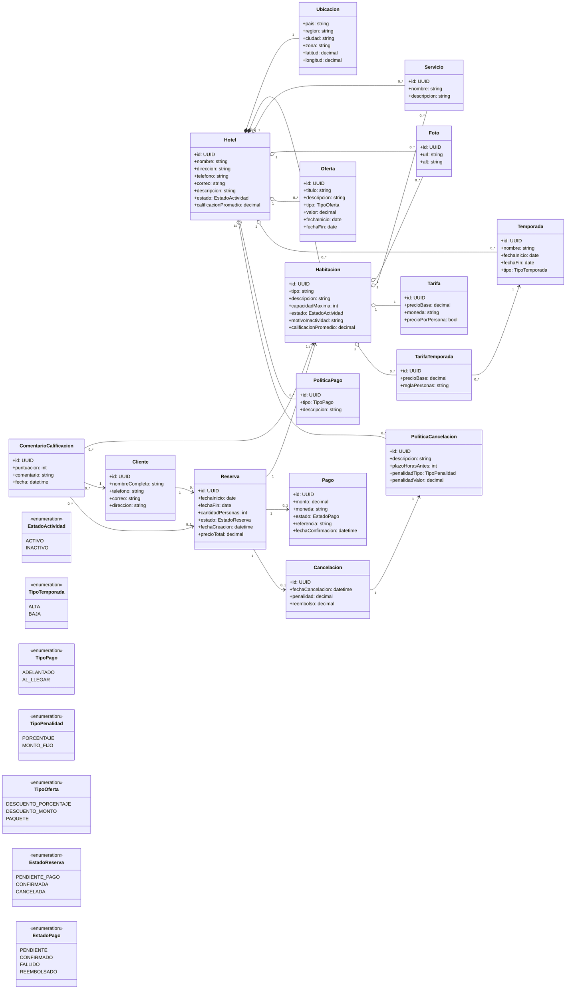

# Diagrama de Clases — Sistema de Reservas de Hoteles

```mermaid
classDiagram
direction LR

class Hotel {
  +id: UUID
  +nombre: string
  +direccion: string
  +telefono: string
  +correo: string
  +descripcion: string
  +estado: EstadoActividad
  +calificacionPromedio: decimal
}

class Ubicacion {
  +pais: string
  +region: string
  +ciudad: string
  +zona: string
  +latitud: decimal
  +longitud: decimal
}

class Servicio {
  +id: UUID
  +nombre: string
  +descripcion: string
}

class Foto {
  +id: UUID
  +url: string
  +alt: string
}

class Habitacion {
  +id: UUID
  +tipo: string
  +descripcion: string
  +capacidadMaxima: int
  +estado: EstadoActividad
  +motivoInactividad: string
  +calificacionPromedio: decimal
}

class Temporada {
  +id: UUID
  +nombre: string
  +fechaInicio: date
  +fechaFin: date
  +tipo: TipoTemporada
}

class PoliticaPago {
  +id: UUID
  +tipo: TipoPago
  +descripcion: string
}

class PoliticaCancelacion {
  +id: UUID
  +descripcion: string
  +plazoHorasAntes: int
  +penalidadTipo: TipoPenalidad
  +penalidadValor: decimal
}

class Oferta {
  +id: UUID
  +titulo: string
  +descripcion: string
  +tipo: TipoOferta
  +valor: decimal
  +fechaInicio: date
  +fechaFin: date
}

class Tarifa {
  +id: UUID
  +precioBase: decimal
  +moneda: string
  +precioPorPersona: bool
}

class TarifaTemporada {
  +id: UUID
  +precioBase: decimal
  +reglaPersonas: string
}

class Cliente {
  +id: UUID
  +nombreCompleto: string
  +telefono: string
  +correo: string
  +direccion: string
}

class Reserva {
  +id: UUID
  +fechaInicio: date
  +fechaFin: date
  +cantidadPersonas: int
  +estado: EstadoReserva
  +fechaCreacion: datetime
  +precioTotal: decimal
}

class Pago {
  +id: UUID
  +monto: decimal
  +moneda: string
  +estado: EstadoPago
  +referencia: string
  +fechaConfirmacion: datetime
}

class Cancelacion {
  +id: UUID
  +fechaCancelacion: datetime
  +penalidad: decimal
  +reembolso: decimal
}

class ComentarioCalificacion {
  +id: UUID
  +puntuacion: int
  +comentario: string
  +fecha: datetime
}

class EstadoActividad {
  <<enumeration>>
  ACTIVO
  INACTIVO
}

class TipoTemporada {
  <<enumeration>>
  ALTA
  BAJA
}

class TipoPago {
  <<enumeration>>
  ADELANTADO
  AL_LLEGAR
}

class TipoPenalidad {
  <<enumeration>>
  PORCENTAJE
  MONTO_FIJO
}

class TipoOferta {
  <<enumeration>>
  DESCUENTO_PORCENTAJE
  DESCUENTO_MONTO
  PAQUETE
}

class EstadoReserva {
  <<enumeration>>
  PENDIENTE_PAGO
  CONFIRMADA
  CANCELADA
}

class EstadoPago {
  <<enumeration>>
  PENDIENTE
  CONFIRMADO
  FALLIDO
  REEMBOLSADO
}

Hotel "1" *-- "1" Ubicacion
Hotel "1" *-- "0..*" Habitacion
Hotel "1" o-- "0..*" Servicio
Hotel "1" o-- "0..*" Foto
Hotel "1" o-- "0..*" Oferta
Hotel "1" o-- "0..*" Temporada
Hotel "1" o-- "0..*" PoliticaPago
Hotel "1" o-- "0..*" PoliticaCancelacion

Habitacion "1" o-- "0..*" Foto
Habitacion "1" o-- "0..*" Servicio
Habitacion "1" o-- "1" Tarifa
Habitacion "1" o-- "0..*" TarifaTemporada
TarifaTemporada "0..*" --> "1" Temporada

Cliente "1" --> "0..*" Reserva
Reserva "1" --> "1" Habitacion
Reserva "1" --> "0..1" Pago
Reserva "1" --> "0..1" Cancelacion
Cancelacion "1" --> "1" PoliticaCancelacion

ComentarioCalificacion "0..*" --> "1" Habitacion
ComentarioCalificacion "0..*" --> "1" Cliente
ComentarioCalificacion "0..*" --> "0..1" Reserva
```
